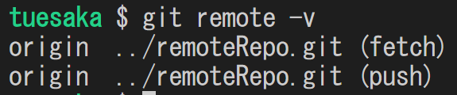
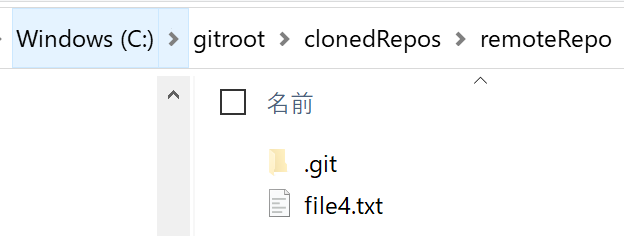

# **Exercise 1 回答**

- C:\gitroot\firstRepo がリポジトリになっていること  

  

- file1.txt が Commit されていてファイルの内容が指示通りであること  

    

- file2.txt が Commit されていてファイルの内容が指示通りであること  

    

- Commit ログが２つあり、最初の Commit には file1.txt だけが保持されており、２つ目の Commit には file2.txt が保持されていること  

   

   

  

***

# **Exercise 2 回答**

- Commit ログは下図と同じであること  

    

- BranchA に Commit が１つあり file2.txt の内容が以下の通りであること  

    

- main に Commit が３つあり file1.txt の内容が以下の通りであること  

  

***

# **Exercise 3 回答**

- merge が完了すること( Commit ログが下図と同じであること)  
  - Conflict が発生しなかったこと
  - BranchA が削除されていること  

  

- file1.txt の内容が下記になっていること  

  

- file2.txt の内容が下記になっていること  
  

***

# **Exercise 4 回答**

- merge が完了すること( Commit ログが下図と同じであること)  
  - Conflict が発生したこと
  - Branchb が削除されていること  

  

- file3.txt の内容が下記になっていること  

  

***

# **Exercise 5 回答**

- Fast-forward merge だったこと( Commit ログが下図と同じであること)  
- main と BranchC が最新の Commit であること

  

***

# **Exercise 6 回答**

- remoteRepo.git が bare リポジトリとして初期化されていること

  

- localRepo1 の origin が remoteRepo.git であること

  

- Commit が２つあり、最初の Commit は空 Commit であること
- origin/main と main ブランチの両方が 2つ目の Commit を指していること

  

***

# **Exercise 7 回答**

- ClonedRepos に remoteRepo フォルダが Git リポジトリとして作成されていること

  

- Commit 履歴は BranchD と origin/BranchD が最新であること

  

- Clone した remoteRepo の origin が Exercise 6 のリモートリポジトリであること

  

- Exercise 6 の ローカルリポジトリの Commit 履歴が Exercise 7 と同じであること
  - 下図の状態の時はまだ Checkout していない  
    

***

# **Exercise 8 回答**

- localRepo1, ClonedRepos 配下の remoteRepo 共に最新の Commit が Revert であること

  

- revert 前の file4.txt の内容が以下であること

  

- revert 後の file4.txt の内容が以下であること

  

***

# **Exercise 9 回答**

- file5.txt への変更が Stage 前の状態であること

  

- file5.txt の内容が以下の通りであること

   

- Commit 後に reset した結果が残っていること

  

- reset 前の状態に戻して reset 前の Commit が正しく行われたことを確認すること
  - コマンドで reset した後の Commit 履歴が以下であること

    

  - file5.txt の内容が以下であること

   

***

# **Exercise 10 回答**

- Conflict したことを確認

  

- Merge の取り消しの確認
  - main と BranchE が 最初から数えて2番目の Commit で分岐していること

   

  - 最後の Commit への操作が reset であること

    

  - main ブランチの file5.txt の内容が以下の通りであること

    

  - BranchE の file5.txt の内容が以下の通りであること

    

***

# **Exercise 11 回答**

- Commit が３つ状態の確認

  

- Branch の切り忘れ時の方法
  1. 最新の Commit に対して BranchF を切る 

    

  2. main ブランチへ移動

    

  3. first commit を指定して reset

    

  4. reset オプションは hard を指定

    

  5. main にいるので、 BranchF へ移動

    

  6. 完了

   
