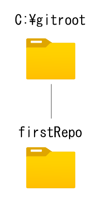
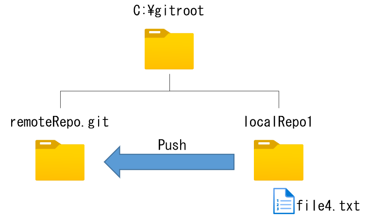
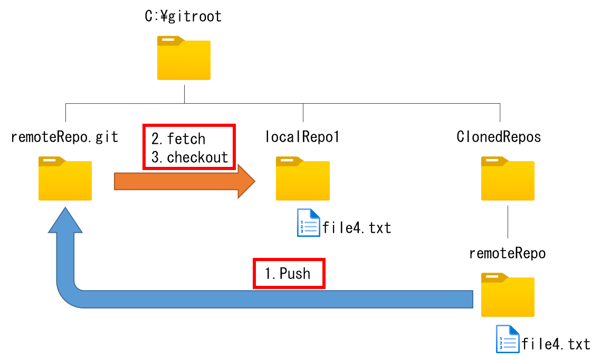
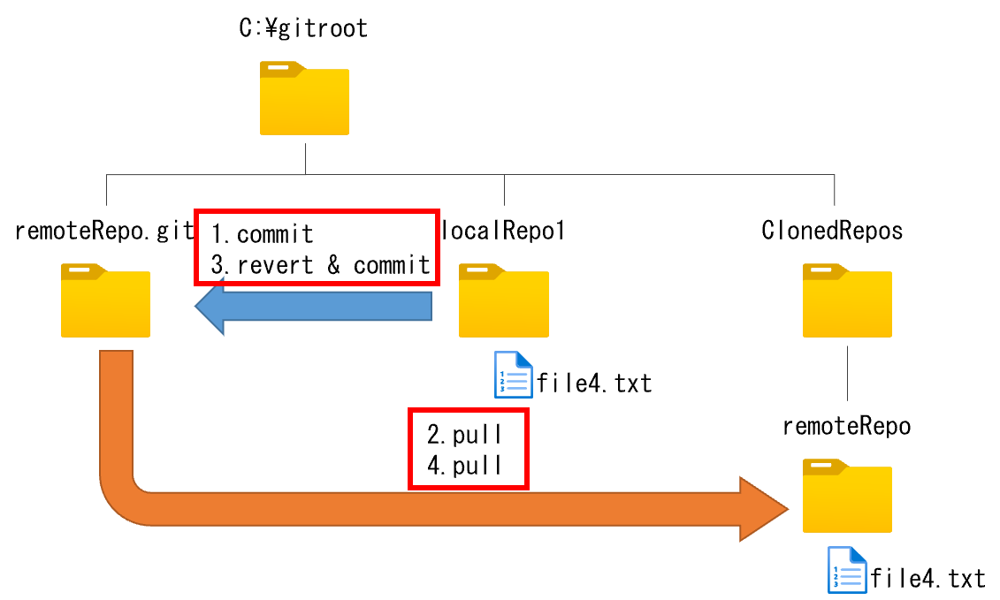
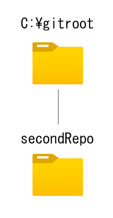
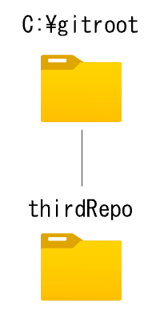
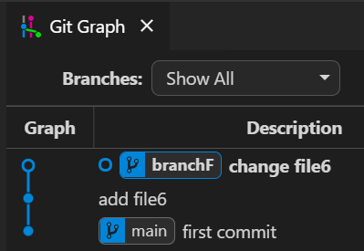

## **Contents**

<!-- @import "[TOC]" {cmd="toc" depthFrom=1 depthTo=6 orderedList=false} -->

<!-- code_chunk_output -->

- [**準備**](#準備)
- [**Exercise 1 - ローカルリポジトリを作成し、ファイルを Commit する**](#exercise-1---ローカルリポジトリを作成しファイルを-commit-する)
  - [Exercise 1 内容](#exercise-1-内容)
  - [Exercise 1 達成条件](#exercise-1-達成条件)
- [**Exercise 2 - Branch を作成して Commit する**](#exercise-2---branch-を作成して-commit-する)
  - [Exercise 2 内容](#exercise-2-内容)
  - [Exercise 2 達成条件](#exercise-2-達成条件)
- [**Exercise 3 - Merge する**](#exercise-3---merge-する)
  - [Exercise 3 内容](#exercise-3-内容)
  - [Exercise 3 達成条件](#exercise-3-達成条件)
- [**Exercise 4 - merge で発生した Conflict を解決する**](#exercise-4---merge-で発生した-conflict-を解決する)
  - [Exercise 4 内容](#exercise-4-内容)
  - [Exercise 4 達成条件](#exercise-4-達成条件)
- [**Exercise 5 - Fast Forward Merge する**](#exercise-5---fast-forward-merge-する)
  - [Exercise 5 内容](#exercise-5-内容)
  - [Exercise 5 達成条件](#exercise-5-達成条件)
- [**Exercise 6 - リモートリポジトリを作成してローカルリポジトリと同期する**](#exercise-6---リモートリポジトリを作成してローカルリポジトリと同期する)
  - [Exercise 6 内容](#exercise-6-内容)
  - [Exercise 6 達成条件](#exercise-6-達成条件)
- [**Exercise 7 - リモートリポジトリから Clone してから Push する**](#exercise-7---リモートリポジトリから-clone-してから-push-する)
  - [Exercise 7 内容](#exercise-7-内容)
  - [Exercise 7 達成条件](#exercise-7-達成条件)
- [**Exercise 8 - Commit を Revert して Push する**](#exercise-8---commit-を-revert-して-push-する)
  - [Exercise 8 内容](#exercise-8-内容)
  - [Exercise 8 達成条件](#exercise-8-達成条件)
- [**Exercise 9 - Commit を取り消すが編集内容は残す**](#exercise-9---commit-を取り消すが編集内容は残す)
  - [Exercise 9 内容](#exercise-9-内容)
  - [Exercise 9 達成条件](#exercise-9-達成条件)
- [**Exercise 10 - Conflict した Merge を 取り消す**](#exercise-10---conflict-した-merge-を-取り消す)
  - [Exercise 10 内容](#exercise-10-内容)
  - [Exercise 10 達成条件](#exercise-10-達成条件)
- [**Exercise 11 - Branch を切り忘れた Commit を移動する**](#exercise-11---branch-を切り忘れた-commit-を移動する)
  - [Exercise 11 内容](#exercise-11-内容)
  - [Exercise 11 達成条件](#exercise-11-達成条件)

<!-- /code_chunk_output -->

# **準備**

- ローカル環境
  - Visual Studio Code のインストール  
    <https://azure.microsoft.com/ja-jp/products/visual-studio-code/>

  - Git のインストール  
    <https://git-scm.com/>

  - Git Graph のインストール (VS Code プラグイン)  
    <https://marketplace.visualstudio.com/items?itemName=mhutchie.git-graph>

***

# **Exercise 1 - ローカルリポジトリを作成し、ファイルを Commit する**

## Exercise 1 内容



- ローカルリポジトリは C:\gitroot フォルダ配下に作成してください。
  - ローカルリポジトリ名は firstRepo としてください。
- main ブランチに Commit を２つ作ってください。
  - master ブランチでも OK
- 1つ目の Commit について
  - 作成するファイル名は file1.txt としてください。
  - file1.txt には以下の内容を保存してください。

    ```text
    This first line is in file1
    ```

  - Commit メッセージには以下を入力してください。

    ```text
    add file1

    - file1.txtを追加
    ```

- 2つ目の Commit について
  - 作成するファイル名は file2.txt としてください。
  - file2.txt には以下の内容を保存してください。

    ```text
    This first line is in file2
    ```

  - Commit メッセージには以下を入力してください。

    ```text
    add file2

    - file2.txtを追加
    ```

## Exercise 1 達成条件

- コーチが以下を確認して OK であること
- C:\gitroot\firstRepo がリポジトリになっていること
- file1.txt が Commit されていてファイルの内容が指示通りであること
- file2.txt が Commit されていてファイルの内容が指示通りであること
- Commit ログが２つあり、最初の Commit には file1.txt だけが保持されており、２つ目の Commit には file2.txt が保持されていること

***

# **Exercise 2 - Branch を作成して Commit する**

## Exercise 2 内容

- Exercise 1 の２つ目の Commit から Branch を作ってください。
  - Branch 名は BranchA としてください。
- BranchA ブランチで file2.txt を以下の内容に編集して Commit してください。

  ```text
  This first line is in file2
  This line was added in BranchA
  ```

  - Commit メッセージには作業内容をわかりやすく入力してください。

- main ブランチ に切り替えてください。
- file1.txt を以下の内容に編集して Commit してください。

  ```text
  This first line is in file1
  This line was added in main
  ```

  - Commit メッセージには作業内容をわかりやすく入力してください。

## Exercise 2 達成条件

- コーチが以下を確認して OK であること
- BranchA に Commit が１つあり file2.txt の内容が以下の通りであること

  ```text
  This first line is in file2
  This line was added in BranchA
  ```

- main に Commit が３つあり file1.txt の内容が以下の通りであること

  ```text
  This first line is in file1
  This line was added in main
  ```

***

# **Exercise 3 - Merge する**

## Exercise 3 内容

- Exercise 2 で作成した BranchA ブランチを main ブランチへ merge してください。
- merge 後、 BranchA を削除してください。

## Exercise 3 達成条件

- コーチが以下を確認して OK であること
- merge が完了すること
  - Conflict が発生しなかったこと（口頭確認）
- BranchA が削除されていること
- file1.txt の内容が下記になっていること

  ```text
  This first line in file1
  This line was added in main
  ```

- file2.txt の内容が下記になっていること

```text
  first line in file2
  This line was added in BranchA
```

***

# **Exercise 4 - merge で発生した Conflict を解決する**

## Exercise 4 内容

- 新しく file3.txt を追加して Conflict させてください。
- file3.txt を main ブランチに追加して Commit してください。
  - file3.txt には以下の内容を保存してください。
  - Commit メッセージはわかりやすいものにしてください。

    ```text
    This first line was added in main
    ```

- file3.txt を追加した Commit に対して Branch を切ってください。
- Branch 名は BranchB としてください。
- BranchB で file3.txt を次のように編集して Commit してください。
  - Commit メッセージはわかりやすいものにしてください。

    ```text
    This first line was added in main
    This second line was added in BranchB
    ```

- main ブランチへ切り替えて、file3.txt を次のように編集して　Commit してください。
  - Commit メッセージはわかりやすいものにしてください。

    ```text
    This first line was added in main
    This second line was added in main
    ```

- BranchB ブランチを main ブランチへ merge してください。
- file3.txt のConflict を次のように解決してください。

    ```text
    This first line was added in main
    This second line was added in main
    This third line was added in BranchB
    ```

- merge 時の Commit メッセージは適切なものを自分で入力してください。
- merge 後、 BranchB を削除してください。

## Exercise 4 達成条件

- コーチが以下を確認して OK であること
- Conflict を解決して merge が完了したこと
- BranchB が削除されていること
- file3.txt の内容が下記になっていること

  ```text
  This first line was added in main
  This second line was added in main
  This third line was added in BranchB
  ```

***

# **Exercise 5 - Fast Forward Merge する**

## Exercise 5 内容

- Exercise 4 で merge した Commit から Branch を作成してください。
  - Branch 名は BranchC としてください。
- BranchC で file3.txt を次のように編集して Commit してください。
  - Commit メッセージはわかりやすいものにしてください。

    ```text
    This first line was added in main
    This second line was added in main
    This third line was added in BranchB
    This forth line was added in BranchC
    ```

- main ブランチへ切り替えて BranchC を merge してください。
- BranchC を**削除しないで**残してください。

## Exercise 5 達成条件

- コーチが以下を確認して OK であること
- Fast-forward merge だったこと
  - コマンドで確認

    ```text
    git reflog
    ```

- main と BranchC が一番最新 Commit であること

***

# **Exercise 6 - リモートリポジトリを作成してローカルリポジトリと同期する**

## Exercise 6 内容



- リモートリポジトリは C:\gitroot フォルダ配下に作成してください。
  - リモートリポジトリ名は remoteRepo.git としてください。
  - bare リポジトリとして remoteRepo.git を初期化してください。
    - ※ VS Code ではできません

- 新しいローカルリポジトリを作成してリモートリポジトリと紐づけてください。
  - ローカルリポジトリは C:\gitroot フォルダ配下に作成してください。
  - ローカルリポジトリ名は localRepo1 としてください。
  - ローカルリポジトリとリモートリポジトリを紐づけてください。
    - リモート名は origin としてください。

- 紐づけを確認するために「ローカルリポジトリ」で Commit した結果を **Push** してリモートと同期してください。
  - 最初の Commit は空の Commit を入れてください。
    - Commit メッセージは以下にしてください。

      ```text
      first commit
      ```

  - main ブランチで file4.txt を追加してください。
    - file4.txt には以下の内容を保存してください。
    - Commit メッセージはわかりやすいものにしてください。

      ```text
      This first line was added in main
      ```

## Exercise 6 達成条件

- コーチが以下を確認して OK であること
- remoteRepo.git が bare リポジトリとして初期化されていること
- localRepo1 の origin が remoteRepo.git であること
  - コマンドで確認すること

    ```PowerShell
    git remote -v
    ```

- Commit が２つあり、最初の Commit は空 Commit であること
- origin/main と main ブランチの両方が 2つ目の Commit を指していること

***

# **Exercise 7 - リモートリポジトリから Clone してから Push する**

## Exercise 7 内容



- Clone で 新しくローカルリポジトリを作成してください。
  - C:\gitroot 配下に ClonedRepos というフォルダを作り、ClonedRepos 内部に Exercise 6 で作成したリモートリポジトリを Clone してください。
  - Clone したら作成されたフォルダを VS Code で開き直してください。

- ローカルリポジトリで作業してリモートへ Push してください。
  - 新しく作成したローカルリポジトリで Branch を作成してください。
    - Branch 名は BranchD としてください。
  - file4.txt を次の内容で編集して Commit して Push してください。

    ```text
    This first line was added in main
    This second line was added in clonedRepo
    ```

- Exercise 6 のローカルリポジトリ（localRepo1）で origin/BranchD が存在することを確認したら BranchD を Checkout して編集可能な状態にしてください。

## Exercise 7 達成条件

- コーチが以下を確認して OK であること
- ClonedRepos に remoteRepo フォルダが Git リポジトリとして作成されていること
- Commit 履歴は BranchD と origin/BranchD が最新であること
- Clone した remoteRepo の origin が Exercise 6 のリモートリポジトリであること
  - コマンドで確認すること

    ```PowerShell
    git remote -v
    ```

- Exercise 6 の ローカルリポジトリの Commit 履歴が Exercise 7 と同じであること

***

# **Exercise 8 - Commit を Revert して Push する**

## Exercise 8 内容



- localRepo1 の BranchD にて Commit して Push してください。
  - file4.txt を次の内容に編集して Commit, Push してください。

    ```text
    This first line was added in main
    This second line was added in clonedRepo
    This line will be reverted
    ```

- ClonedRepos 配下の remoteRepo で Pull して Commit を確認してください。
- localRepo1 で さきほど Commit した内容を Revert して Push してください。
- ClonedRepos 配下の remoteRepo で Pull して Commit を確認してください。

## Exercise 8 達成条件

- コーチが以下を確認して OK であること
- localRepo1, ClonedRepos 配下の remoteRepo 共に最新の Commit が Revert であること
- revert 前の file4.txt の内容が以下であること
- revert 後の file4.txt の内容が以下であること

  ```text
  This first line was added in main
  This second line was added in clonedRepo
  ```

***

# **Exercise 9 - Commit を取り消すが編集内容は残す**

## Exercise 9 内容



- 新しくローカルリポジトリを作成してください。
  - ローカルリポジトリは C:\gitroot フォルダ配下に作成してください。
    - ローカルリポジトリ名は secondRepo としてください。
  - Commit を３つ作ってください。
    - main の1つ目の Commit は空 Commit にしてください。
      - Commit メッセージは以下にしてください。

        ```text
        first commit
        ```
    - 2つ目の Commit について
      - main ブランチで作業してください。
      - 新しくファイルを作成してください。
      - 作成するファイル名は file5.txt としてください。
      - file5.txt は以下の内容で Commit してください。

        ```text
        This first line is in file5
        ```

    - 2つ目の Commit から Branch を切ってください。
      - Branch 名は BranchE です。

    - 3つ目の Commit について
      - BranchE で 作業してください。
      - file5.txt を以下の内容に編集して Commit してください。

        ```text
        This first line is in file5
        This second line is in BranchE
        ```

- 3つ目の Commit を reset で削除してください。
- ただし、Workspace に file5.txt の編集結果は残った状態にしてください。

## Exercise 9 達成条件

- コーチが以下を確認して OK であること
- file5.txt への変更が Stage 前の状態であること
- file5.txt の内容が以下の通りであること

  ```text
  This first line is in file5
  This second line in BranchE
  ```

- Commit 後に reset した結果が残っていること
  - コマンドで確認

    ```text
    git reflog
    ```

- reset 前の状態に戻して reset 前の Commit が正しく行われたことを確認すること
  - コマンドで確認

    ```text
    Linux : git reset --hard HEAD@{1}
    Windows : git reset --hard 'HEAD@{1}'
    ```

***

# **Exercise 10 - Conflict した Merge を 取り消す**

## Exercise 10 内容

- Exercise 9 の リポジトリを使用します。
  - ※ コーチの確認によって、reset 前の状態に戻っていることを確認してください。
- main ブランチに切り替えて file5.txt を以下の内容で編集して Commit してください。

  ```text
  This first line is in file5
  This second line is in main
  ```

- BranchE を main ブランチへ merge してください。
- Conflict したことを確認してください。

- **Conflict していることをコーチに確認してもらってから先へ進んでください**

- merge を取り消してください。

## Exercise 10 達成条件

- コーチが以下を確認して OK であること
- main と BranchE が 最初から数えて2番目の Commit で分岐していること
- 最後の Commit への操作が reset であること
  - コマンドで確認

    ```text
    git reflog
    ```

- main ブランチの file5.txt の内容が以下の通りであること

  ```text
  This first line is in file5
  This second line is in main
  ```

- BranchE の file5.txt の内容が以下の通りであること

  ```text
  This first line is in file5
  This second line in BranchE
  ```

***

# **Exercise 11 - Branch を切り忘れた Commit を移動する**

## Exercise 11 内容



- 新しくローカルリポジトリを作成してください。
  - ローカルリポジトリは C:\gitroot フォルダ配下に作成してください。
    - ローカルリポジトリ名は thirdRepo としてください。
  - Commit を３つ作ってください。
    - main の1つ目の Commit は空 Commit にしてください。
      - Commit メッセージは以下にしてください。

        ```text
        first commit
        ```

    - 2つ目の Commit について
      - main ブランチで作業してください。
      - 新しくファイルを作成してください。
      - 作成するファイル名は file6.txt としてください。
      - file6.txt は以下の内容で Commit してください。

        ```text
        This is the first line
        ```

    - 3つ目の Commit について
      - main ブランチで作業してください。
      - file6.txt を以下の内容で Commit してください。

        ```text
        This is the first line
        This is the second line
        ```

- **Commit が3つできていることをコーチに確認してもらってから先へ進んでください**

- 最初の Commit に対して Branch を作るべきでした。下図と同じ結果となるように Commit を修正してください。

  

## Exercise 11 達成条件

- コーチが以下を確認して OK であること
- Commit 履歴が図の通りとなること
